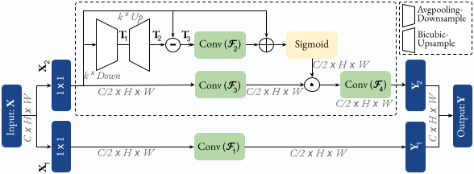
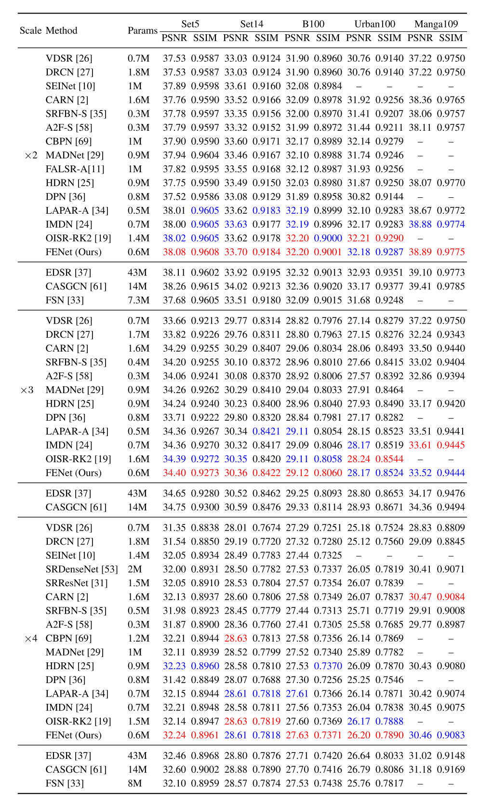
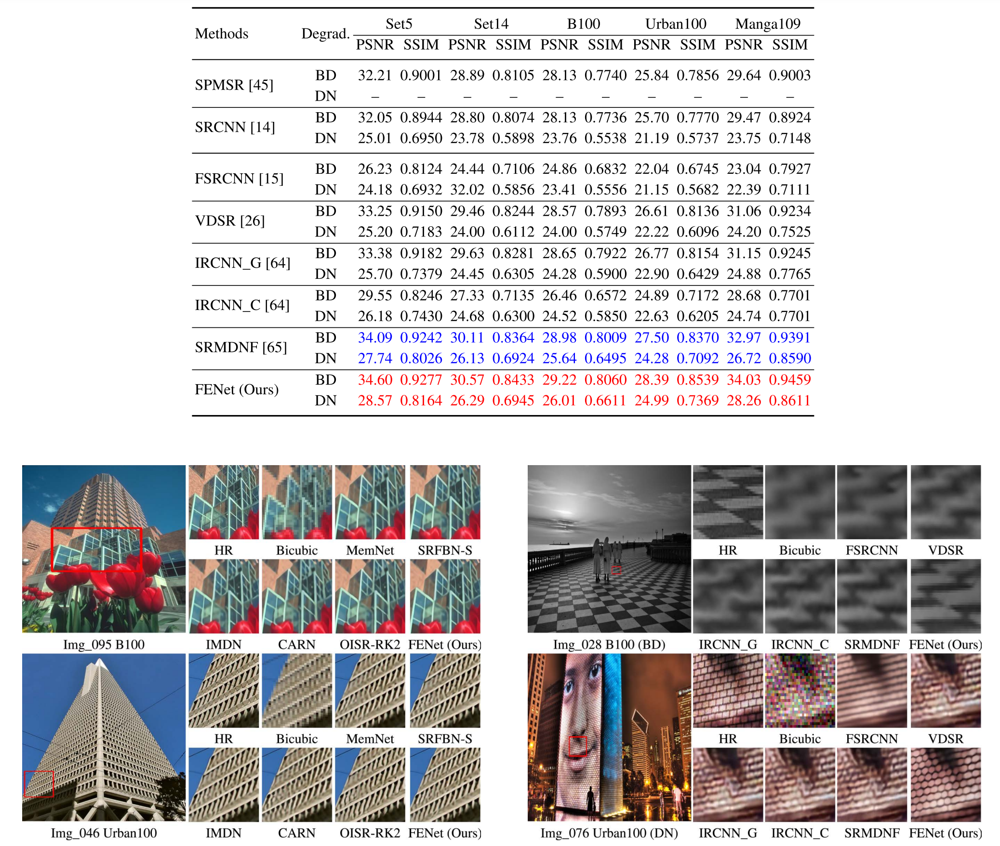

# FENet-PyTorch
### **This is repository is an official PyTorch implementation of the paper "Frequency-based Enhancement Network for Efficient Super-Resolution".** 
IEEE Access, 2022. [[Paper](https://ieeexplore.ieee.org/document/9778017)] 


### Requirements
- Python 3
- [PyTorch](https://github.com/pytorch/pytorch) (0.4.0), [torchvision](https://github.com/pytorch/vision)
- Numpy, Scipy
- Pillow, Scikit-image
- h5py
- importlib


#### Contents
1. [Introduction](#Introduction)
1. [Dataset](#Dataset)
1. [Testing](#Testing)
1. [Training](#Training)
1. [Results](#Results)
1. [Citetion](#Citetion)


### Introduction 
Recently, deep convolutional neural networks (CNNs) have provided outstanding performance in single image super-resolution (SISR). Despite their remarkable performance, the lack of high-frequency information in the recovered images remains a core problem. Moreover, as the networks increase in depth and width, deep CNN-based SR methods are faced with the challenge of computational complexity in practice. A promising and under-explored solution is to adapt the amount of compute based on the different frequency bands of the input. To this end, we present a novel Frequency-based Enhancement Block (FEB) which explicitly enhances the information of high frequencies while forwarding low-frequencies to the output. In particular, this block efficiently decomposes features into low- and high-frequency and assigns more computation to high-frequency ones. Thus, it can help the network generate more discriminative representations by explicitly recovering finer details. Our FEB design is simple and generic and can be used as a direct replacement of commonly used SR blocks with no need to change network architectures.  We experimentally show that when replacing SR blocks with FEB we consistently improve the reconstruction error, while reducing the number of parameters in the model. Moreover, we propose a lightweight SR model --- Frequency-based Enhancement Network (FENet) --- based on FEB that matches the performance of larger models. Extensive experiments demonstrate that our proposal performs favorably against the state-of-the-art SR algorithms in terms of visual quality, memory footprint, and inference time. 
<div align="center">
  
</div>

### Dataset
We use DIV2K dataset for training and Set5, Set14, B100, and Urban100 dataset for the benchmark test. Here are the following steps to prepare datasets.

1. Download [DIV2K](https://data.vision.ee.ethz.ch/cvl/DIV2K) and unzip on `dataset` directory as below:
  ```
  dataset
  └── DIV2K
      ├── DIV2K_train_HR
      ├── DIV2K_train_LR_bicubic
      ├── DIV2K_valid_HR
      └── DIV2K_valid_LR_bicubic
  ```
2. To accelerate training, we first convert training images to h5 format as follow (h5py module has to be installed).
```shell
$ python div2h5.py
```
3. Other benchmark datasets can be downloaded in [Google Drive](https://drive.google.com/drive/folders/1t2le0-Wz7GZQ4M2mJqmRamw5o4ce2AVw?usp=sharing). Same as DIV2K, please put all the datasets in `dataset` directory.


### Testing
We provide the pretrained models in `checkpoint` directory. All visual results of FENet for scale factor x2, x3, and x4 (BI) can be downloaded [here](https://drive.google.com/drive/folders/19u-5j5uKv1QfB7Urmy8LHI6UYf9gaouV?usp=sharing). To test FENet on benchmark datasets:
```shell
# Scale factor x2
$ python sample.py      --test_data_dir dataset/<dataset> --scale 2 --ckpt_path ./checkpoint/<path>.pth --sample_dir <sample_dir>

# Scale factor x3                
$ python sample.py      --test_data_dir dataset/<dataset> --scale 3 --ckpt_path ./checkpoint/<path>.pth --sample_dir <sample_dir>

# Scale factor x4
$ python sample.py      --test_data_dir dataset/<dataset> --scale 4 --ckpt_path ./checkpoint/<path>.pth --sample_dir <sample_dir>
```
### Training
Here are our settings to train FENet. Note: We use two GPU to utilize large batch size, but if OOM error arise, please reduce batch size.
```shell
# Scale factor x2
$ python train.py --patch_size 64 --batch_size 64 --max_steps 600000 --lr 0.001 --decay 150000 --scale 2  

# Scale factor x3
$ python train.py --patch_size 64 --batch_size 64 --max_steps 600000 --lr 0.001 --decay 150000 --scale 3  

# Scale factor x4
$ python train.py --patch_size 64 --batch_size 64 --max_steps 600000 --lr 0.001 --decay 150000 --scale 4                 
                      
 ```

### Results
We achieved state-of-the-art performance on lightweigh image SR, denoising and deblurring. All visual results (BI, BD, and DN) of FENet can be downloaded [here](https://drive.google.com/drive/folders/19u-5j5uKv1QfB7Urmy8LHI6UYf9gaouV?usp=sharing).
<details>
<summary>Lightweight Single Image Super-Resolution (click me)</summary>
<p align="center">
  
  
</p>
</details>

<details>
<summary>Image denoising and deblurring (click me)</summary>
<p align="center">
  
</p>
  </details>

   
## Citation
```
@article{behjati2022frequency,
  title={Frequency-Based Enhancement Network for Efficient Super-Resolution},
  author={Behjati, Parichehr and Rodriguez, Pau and Tena, Carles Fern{\'a}ndez and Mehri, Armin and Roca, F Xavier and Ozawa, Seiichi and Gonz{\`a}lez, Jordi},
  journal={IEEE Access},
  volume={10},
  pages={57383--57397},
  year={2022},
  publisher={IEEE}
}
```
This implementation is for non-commercial research use only. If you find this code useful in your research, please cite the above paper. Please also see our other works:

- Single image super-resolution based on directional variance attention network - Pattern Recognition, 2022. [[Paper](https://www.sciencedirect.com/science/article/pii/S0031320322004770?dgcid=author)] [[Code](https://github.com/pbehjatii/DiVANet)] 

- OverNet: Lightweight Multi-Scale Super-Resolution with Overscaling Network - WACV, 2022- [[Paper](https://openaccess.thecvf.com/content/WACV2021/papers/Behjati_OverNet_Lightweight_Multi-Scale_Super-Resolution_With_Overscaling_Network_WACV_2021_paper.pdf)] 
[[Code](https://github.com/pbehjatii/OverNet-PyTorch)] 

- Hierarchical Residual Attention Network for Single Image Super-Resolution [[arXiv](https://arxiv.org/abs/2012.04578)]


 
